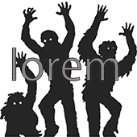
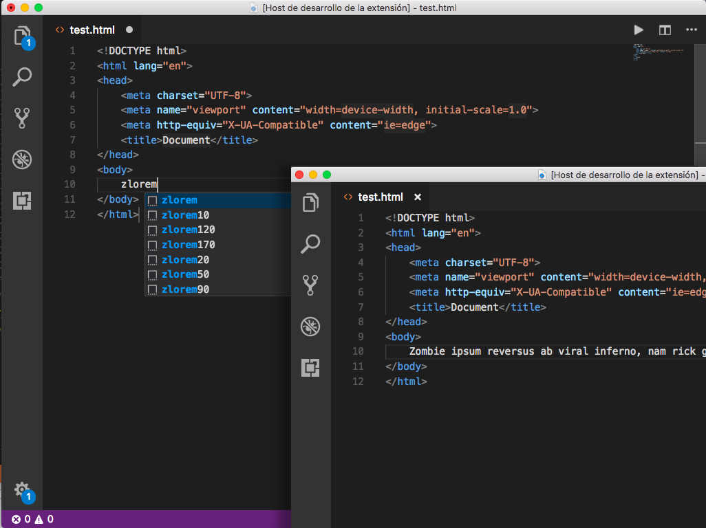

## LOREM ZOMBIE

## Description
>Is a version zombie of a filler text or greeking commonly used to demonstrate the textual elements of a graphic document or visual presentation. Replacing meaningful content with placeholder text allows designers to design the form of the content before the content itself has been produced

>Es la version zombie del texto que se usa habitualmente en diseño gráfico en demostraciones de tipografías o de borradores de diseño para probar el diseño visual antes de insertar el texto final.

## Use

> \> zlorem

param     | nº words generated
--------- | --- 
*zlorem*  | 30 
*zlorem10* | 10 
*zlorem12* | 20 
*zlorem50* | 50 
*zlorem90* | 90 
*zlorem120* | 120 
*zlorem170* | 170 